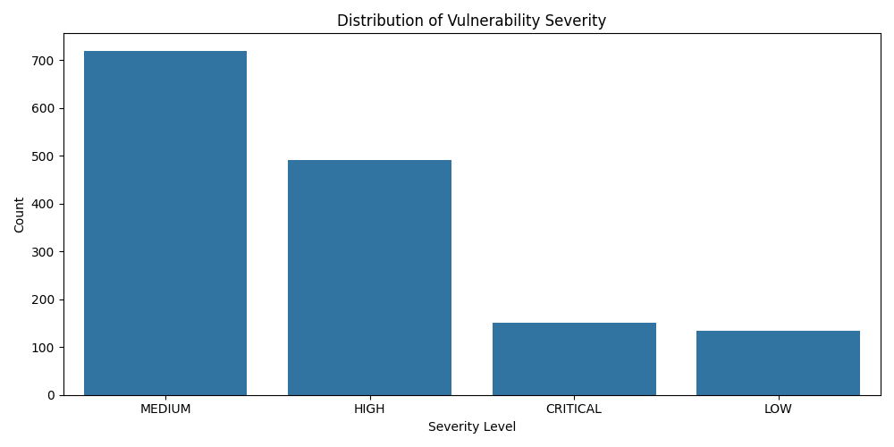
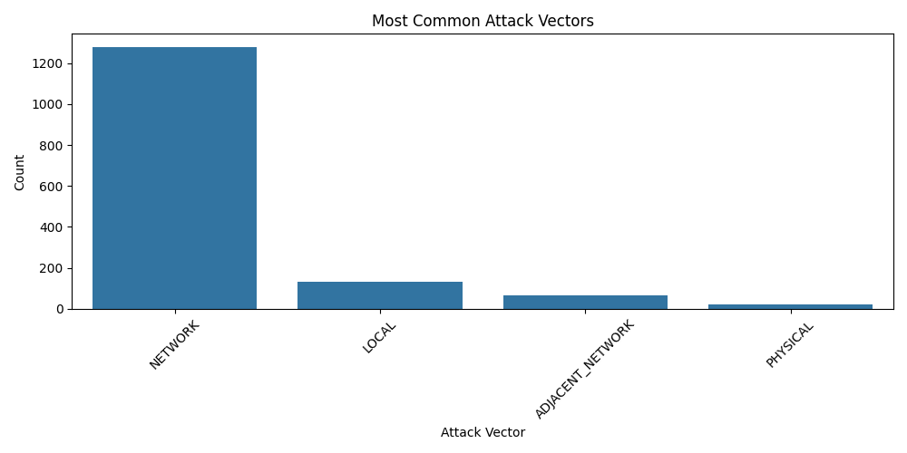
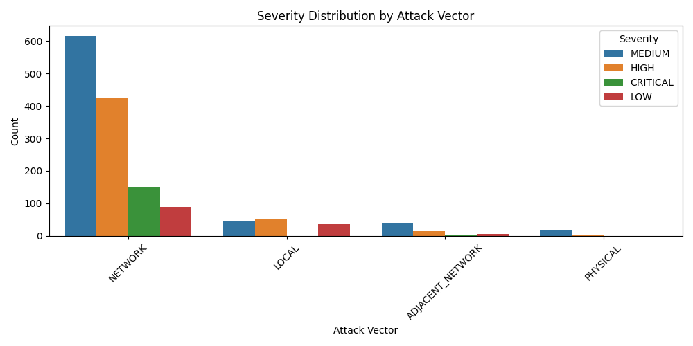

# Healthcare Cybersecurity Analysis

Software engineer transitioning into data science and digital transformation through cybersecurity analytics.

---

# Project Overview

Analysis of cybersecurity vulnerabilities affecting healthcare systems using Python, SQL, and Power BI techniques.

---

# Objectives

- Identify the most common vulnerabilities
- Analyze severity distribution
- Detect dominant attack vectors
- Explore cybersecurity risk patterns

---

# Technologies Used

- Python
- Pandas
- Seaborn
- Matplotlib
- SQL
- Power BI

---

# Key Insights

- Medium severity vulnerabilities dominate the dataset
- CWE-89 (SQL Injection) is among the most frequent weaknesses
- Network attack vectors appear most frequently

---

# Severity Distribution
# This section explores the distribution of vulnerability severity levels.

---

---
# This section explores the distribution of the attack vectors levels

---
# "Severity Distribution by Attack Vector"
# The NETWORK attack vector represents the highest concentration of vulnerabilities
#  in the dataset, with Medium severity cases appearing most frequently, followed by High 
#  severity vulnerabilities.

---
# Top weaknesses
